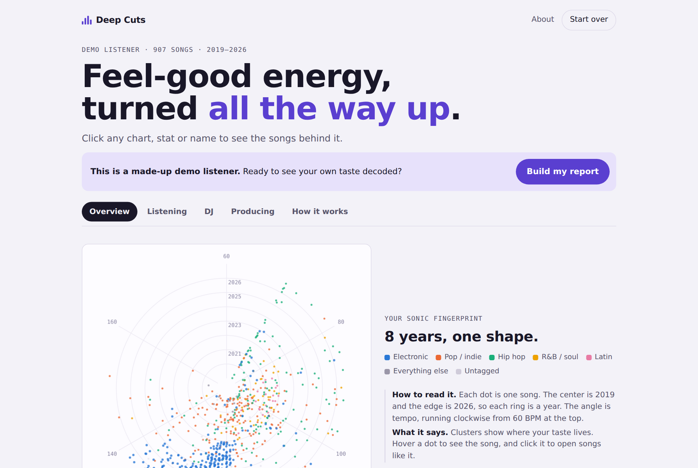
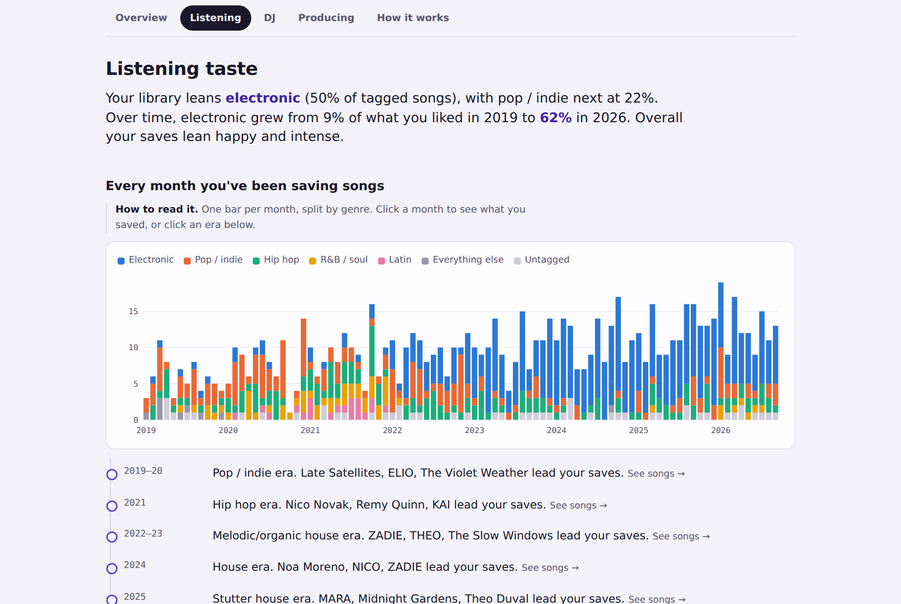
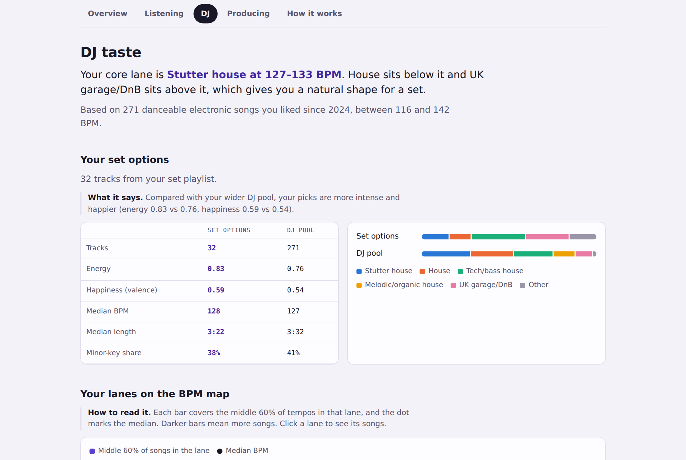
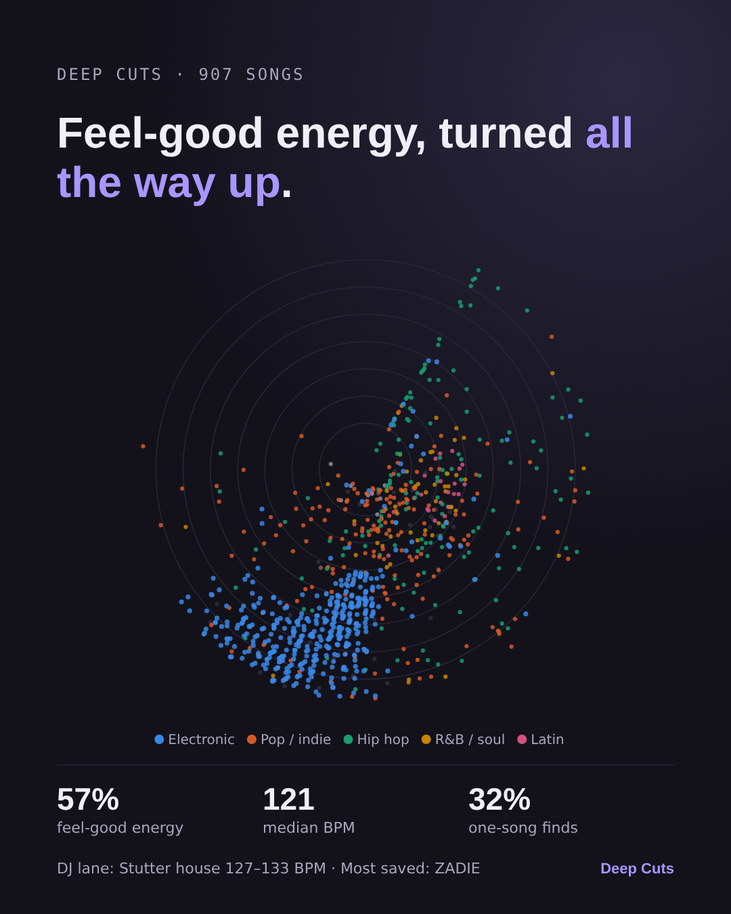

# Deep Cuts

**Your music taste, decoded.** Upload an export of your music library and get an explorable report on who you are as a listener, what kind of DJ you'd be, and the sound you'd make as a producer.

**[Try it → alinaakc.github.io/deep-cuts](https://alinaakc.github.io/deep-cuts)** (no sign-up, and there's a demo if you don't have an export handy)

## Private by design

Everything runs in your browser. Your files are never uploaded, stored or shared. There's no account, no server and no tracking. Close the tab and it's gone.

## What you get

| Report | What it shows |
| --- | --- |
| **Listening** | A sonic fingerprint of every song you've saved, your eras, a mood map, genre shifts over time, a Spotify Wrapped memory lane, and the artists you actually return to. |
| **DJ** | Your lanes on a BPM map, a Camelot key wheel, energy × tempo, a set planner that orders tracks by key and tempo, and forgotten gems worth digging back up. |
| **Producing** | How your inspiration playlist differs from your everyday listening, your target tempo and mood, and a reference board of tracks to study. |

Every chart, stat and name is clickable and opens the songs behind it. The report ends with a share card you can save as an image.

| | |
| --- | --- |
|  |  |

## Works with

- **Spotify** via [Exportify](https://exportify.net) (best: includes tempo, key and mood), or your Spotify account data download
- **Apple Music** library export (XML)
- **rekordbox** collection export (XML)
- **Last.fm** scrobbles (CSV)
- **SoundCloud and other services** via TuneMyMusic or Soundiiz (CSV)

You can combine sources. Deep Cuts merges them and matches songs across services.

## How it works

Genres come from your music service, and tempo, key and mood come from Spotify's audio data. Every insight comes from fixed rules applied to your numbers, not AI guesses. The **How it works** tab in each report shows the math. BPM and key come from automated detection and can be off, so confirm them in your DJ software.

## Built with

Plain HTML, CSS and JavaScript in a single file, plus [PapaParse](https://www.papaparse.com) (CSV) and [JSZip](https://stuk.github.io/jszip/) (zip files). Built with Claude as a coding partner.

## About

I'm Alina. I started DJing this fall and wanted to understand my own taste: what I actually save, how it's changed, and which songs would work in a set. So I built the tool I wanted, then opened it up so anyone can run their own library through it.

---

Deep Cuts is an independent project and isn't affiliated with or endorsed by Spotify, Apple, Last.fm, SoundCloud or AlphaTheta (rekordbox). All trademarks belong to their owners.
